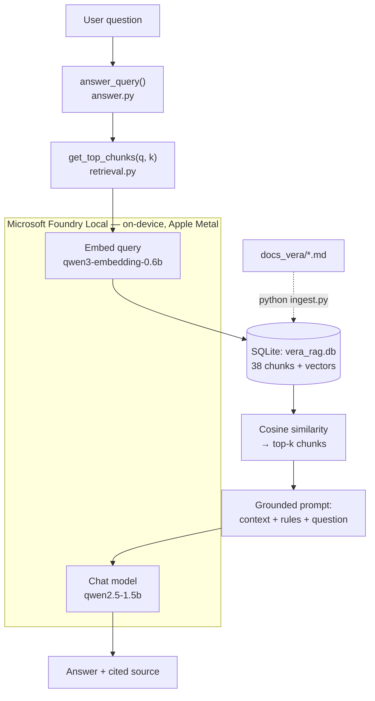

<div align="center">


# Vera-Finance Local RAG Q&A Assistant

**A retrieval-augmented Q&A assistant that runs entirely on your own machine.**
No cloud inference, no API keys, no data leaving the device — model execution happens
on-device through **Microsoft Foundry Local**, GPU-accelerated with Apple Metal.

[](https://www.python.org/)
[](https://learn.microsoft.com/en-us/azure/foundry-local/)
[](https://www.sqlite.org/)
[](LICENSE)

[**Live demo**](https://rag.omerharmankaya.com) · [Requirements](REQUIREMENTS.md) · [Project report](REPORT.md) · [Deployment](server_deploy/README.md)

</div>

---

## What this is

A small local model knows nothing about a niche product, and a large cloud model will
happily invent details about one. **Retrieval-Augmented Generation** fixes both problems:
retrieve the passages that actually answer the question, then instruct the model to answer
*only* from them.

This project applies that to [Vera Finance](https://vera.staticorbit.dev/), an AI-powered
personal finance iOS app. Thirteen curated documents describe the product; the assistant
answers questions about it, cites which document each answer came from, and says
*"I don't have that information"* rather than guessing when the answer isn't in the corpus.

Everything — embeddings, retrieval and generation — runs on the local machine.

| | |
|---|---|
| **Runtime** | [Microsoft Foundry Local](https://learn.microsoft.com/en-us/azure/foundry-local/) (macOS, Apple Silicon, Metal/ONNX Runtime) |
| **Embedding model** | `qwen3-embedding-0.6b` — 1024-dimensional vectors |
| **Chat model** | `qwen2.5-1.5b` |
| **Vector store** | SQLite, one file, brute-force cosine similarity |
| **Knowledge base** | 13 markdown documents → 38 chunks |
| **Typical latency** | ~1–3 s per answer on Apple Silicon GPU |
| **Dependencies** | `foundry-local-sdk`, `openai`, `numpy` |

> Built for the Microsoft AI Innovators program, following the Foundry Local RAG tutorial
> ([Tech Community write-up](https://techcommunity.microsoft.com/blog/azuredevcommunityblog/building-your-first-local-rag-application-with-foundry-local/4501968),
> [official tutorial](https://learn.microsoft.com/en-us/azure/foundry-local/tutorials/tutorial-build-rag-app)).

---

## Architecture



Four small modules over a single SQLite file — no vector database, no server, no network.

| Stage | File | What it does |
|---|---|---|
| **Ingestion** | [`ingest.py`](ingest.py) | Reads `docs_vera/*.md`, splits into paragraph-level chunks, embeds each one, writes `(source, content, embedding)` to SQLite. Idempotent — every run rebuilds the table. |
| **Retrieval** | [`retrieval.py`](retrieval.py) | Embeds the query and ranks every stored chunk by cosine similarity (NumPy, brute force). Returns the top *k* with source names and scores. |
| **Generation** | [`answer.py`](answer.py) | Builds a grounded prompt from the retrieved chunks and calls the local chat model. |
| **Interface** | [`main.py`](main.py) | Interactive CLI with streaming output and per-answer timing. |
| **Model access** | [`foundry_client.py`](foundry_client.py) | One shared Foundry Local manager; lazily downloads and loads the embedding and chat models. |
| **Output guard** | [`text_guard.py`](text_guard.py) | Detects runaway repetition and cuts generation short (see below). |
| **Configuration** | [`config.py`](config.py) | Model aliases, paths, `TOP_K`, sampling parameters. |

### How grounding is enforced

Retrieval alone doesn't stop a model from improvising. The system prompt in
[`answer.py`](answer.py) makes the rules explicit, and the two behaviours that matter most
are the last two:

```text
1. Check whether any context passage is topically related to what the question asks about.
   The question may be in a different language than the passages — judge relevance by topic.
2. If yes: answer using only facts from those passages, in at most 5 sentences,
   and cite the source file, e.g. (source: features-overview.md).
3. If no passage is topically related, reply exactly: "I don't have that information."
```

Answers are further constrained by `TEMPERATURE = 0.1` (near-deterministic) and
`MAX_TOKENS = 300`. When the model doesn't cite a source itself, the retrieved filenames are
appended automatically — so **every answer is traceable to a document**.

### Handling small-model failure modes

A 1.5B model occasionally falls into a degeneration loop and emits the same fragment until
it runs out of tokens:

```
Premium sürüm, hizmetlerini tamamen tamamen tamamen tamamen tamamen tamamen ... (×125)
```

Frequency and presence penalties reduce this, but tuning alone cannot remove it — measured
across the corpus, every penalty setting that fixed one question broke another, and dropping
the penalties entirely produced worse failures (300 characters of `#`). So it is caught in
code instead: [`text_guard.py`](text_guard.py) watches the token stream for a short fragment
repeating back-to-back, stops generation the moment it appears, keeps the usable prefix, and
labels what happened:

```
Premium sürümü, base sürümüne göre, 100% ad-free hizmete erişim sağlar.

[The local model started repeating itself here, so generation was stopped.
 Rephrasing the question usually helps.]
```

If nothing usable survives, the answer is replaced outright rather than shown as noise.
Stopping early also matters on the CPU-only demo server, where the alternative is spending
another 200 tokens' worth of compute generating garbage.

---

## Quickstart

### 1. Install Foundry Local (macOS, Apple Silicon)

```bash
brew tap microsoft/foundrylocal
brew install foundrylocal
foundry service start
```

### 2. Python environment

```bash
python3 -m venv .venv
source .venv/bin/activate
pip install -r requirements.txt
```

### 3. Build the index

Models download automatically on first use (~2 GB total, one time only).

```bash
python ingest.py
```

```
Found 13 document(s) in docs_vera/
Split into 38 chunk(s). Generating embeddings...
Ingestion complete: 38 chunks stored in vera_rag.db
```

### 4. Ask questions

```bash
python main.py
```

```
Vera-Finance Q&A assistant (local, offline — Foundry Local)
Type "quit" to exit.

Question: Where is my financial data stored?
Answer: All core financial data, including transactions, budgets, assets, goals, and
inventory is stored strictly and securely on your own device. This sensitive information
never leaves your phone and cannot be accessed by our servers or any third parties.
(sources: general-terms-and-privacy.md, features-overview.md) (2.4s)

Question: How much does Premium cost per month?
Answer: I don't have that information. (1.5s)
```

The second answer is the one worth pausing on: pricing appears nowhere in the corpus, so
the assistant refuses instead of inventing a number.

One-shot, without the interactive loop:

```bash
python answer.py "How does the personal inflation module work?"
python retrieval.py "data privacy"          # inspect retrieval scores only
```

---

## Configuration

Everything lives in [`config.py`](config.py):

| Setting | Default | Why |
|---|---|---|
| `EMBEDDING_MODEL_ALIAS` | `qwen3-embedding-0.6b` | Small, fast, strong multilingual retrieval. |
| `CHAT_MODEL_ALIAS` | `qwen2.5-1.5b` | Best quality/latency trade-off found; `qwen2.5-0.5b` is faster but follows grounding rules noticeably worse, `qwen3-4b` answers better but breaks the 1–3 s target. |
| `TOP_K` | `5` | Enough breadth for broad questions ("what can the app do?") without bloating the prompt. |
| `MAX_TOKENS` | `300` | Hard ceiling — small models otherwise ramble. |
| `TEMPERATURE` | `0.1` | Near-deterministic; this is a factual Q&A task, not creative writing. |
| `FREQUENCY_PENALTY` / `PRESENCE_PENALTY` | `0.8` / `0.6` | Curb the repetition loops small models fall into. |
| `DOCS_DIR` | `docs_vera/` | Knowledge base — see below. |

### Using your own knowledge base

Drop `.md` or `.txt` files into `docs_vera/` (or point `DOCS_DIR` elsewhere) and re-run
`python ingest.py`. Short, single-topic documents retrieve best; the chunker merges
consecutive short paragraphs and glues headings to the paragraph that follows.

The bundled corpus documents Vera Finance: expense tracking, AI receipt scanning, inventory
and shopping, investment portfolio, savings goals, financial health score, personal
inflation, achievements, free vs premium plans, platform availability, and terms & privacy.

Curation is part of the engineering. Asked *"Does Vera Finance have an Android app?"*, the
assistant used to assert that one existed — no document stated the platform, so the model
filled the gap from its own priors. Adding `platform-and-availability.md`, which says
explicitly what the app does *not* run on, turned that into a correct answer. A grounding
failure is often a documentation gap wearing a disguise.

---

## Repository layout

```
.
├── main.py                  # CLI entry point (the deliverable interface)
├── ingest.py                # docs → chunks → embeddings → SQLite
├── retrieval.py             # cosine-similarity search over stored vectors
├── answer.py                # grounded prompt construction + generation
├── foundry_client.py        # Microsoft Foundry Local SDK wrapper
├── text_guard.py            # repetition/degeneration guard
├── config.py                # models, paths, retrieval & sampling settings
├── test_text_guard.py
├── requirements.txt
├── docs_vera/               # the knowledge base (13 markdown passages)
│
├── REQUIREMENTS.md          # original specification
├── REPORT.md                # project report: decisions, trade-offs, limitations
│
├── RAG/                     # React + Vite frontend for the hosted demo
└── server_deploy/           # Linux/CPU deployment of the same pipeline (FastAPI + Ollama)
    ├── app.py               # HTTP API, streaming answers, rate limiting
    ├── rate_limit.py        # per-visitor + global sliding-window limits
    ├── external_api.py      # authenticated endpoint for the landing-page widget
    └── README.md            # deployment guide
```

---

## The hosted demo

> **[rag.omerharmankaya.com](https://rag.omerharmankaya.com)** — the same pipeline, reachable
> from a browser, also embedded as the Q&A widget on the
> [Vera Finance landing page](https://vera.staticorbit.dev/).

The offline CLI above is the project. The web demo exists so the work can be *shown*, and it
makes one substitution: Foundry Local targets macOS/Windows, while the demo box is a small
Linux VPS, so **Ollama** provides the same OpenAI-compatible local inference there. Retrieval,
chunking, prompting and grounding rules are identical — only the client module differs
(`foundry_client.py` → `ollama_client.py`).

| | Local project | Hosted demo |
|---|---|---|
| Runtime | Foundry Local | Ollama |
| Hardware | Apple Silicon GPU (Metal) | shared vCPU, no GPU |
| Embedding | `qwen3-embedding-0.6b` | `nomic-embed-text` |
| Chat | `qwen2.5-1.5b` | `qwen2.5:1.5b` |
| `TOP_K` | 5 | 3 — smaller prompt, faster CPU prompt-eval |
| Latency | ~1–3 s | ~10–40 s |
| Interface | CLI | React SPA, streamed tokens |

Because a single answer occupies the whole CPU for tens of seconds, the public endpoint is
rate limited in two scopes at once — **every** rule must pass, and a rejected request never
consumes quota:

| Scope | Per second | Per minute | Per day |
|---|---|---|---|
| Per visitor (IP) | 1 | 3 | 10 |
| All visitors combined | 3 | 5 | 100 |

Rejections return `429` with the specific limit that was hit, a `Retry-After` header and a
message the UI shows verbatim ("You've hit the limit of 3 questions per minute. Please wait
38 seconds and try again."), while `X-Demo-Quota-Remaining-Day` lets the page display how
many questions the visitor has left. The demo is also explicit in the UI about being slow and
occasionally wrong — expectations first, apologies never.

Limits live in [`server_deploy/config.py`](server_deploy/config.py); see
[`server_deploy/README.md`](server_deploy/README.md) for the API contract and deployment.

---

## Tests

Stdlib-only (`unittest`) — no pytest, no running model, no network. Generation is stubbed
and time is a fake clock, so the suite runs in milliseconds:

```bash
python -m unittest test_text_guard -v                      # repetition guard (12 tests)
cd server_deploy && python -m unittest discover -v         # + rate limits & API (28 tests)
```

They cover the repetition guard (detection, prefix salvage, streaming across arbitrary token
boundaries, and *not* firing on ordinary bullet lists), the sliding-window limiter
(per-visitor isolation, the global ceiling, all-or-nothing quota consumption, `Retry-After`
accuracy, a distinct message for every rule), and the `/api/ask` 429 payload end to end.

---

## Design decisions

- **SQLite instead of a vector database.** At 38 chunks, brute-force cosine similarity is
  microseconds of NumPy. Pinecone or Chroma would add an external service, a schema and a
  failure mode for zero measurable benefit.
- **Embeddings stored as JSON text.** Inspectable with any SQLite browser. Binary blobs
  would save a couple of megabytes and cost debuggability.
- **Paragraph-level chunking.** The source documents are short, hand-written passages, so
  paragraphs are already natural semantic units — no sliding-window overlap needed.
- **The Foundry Local SDK over raw REST.** The SDK handles model download, loading and
  lifecycle; the endpoint underneath stays OpenAI-compatible either way.
- **Grounding as prompt policy, not post-processing.** Explicit refusal wording
  (`"I don't have that information."`) is a rule the model follows *and* a string the code
  can detect — which is how the source line is suppressed on refusals.
- **In-process rate limiting.** The demo runs as one uvicorn process, so process-local
  sliding windows are exact. Redis would be infrastructure for a problem that doesn't exist yet.
- **A code-level repetition guard rather than more penalty tuning.** Sampling parameters
  traded one model failure for another; a deterministic guard fixes the class of failure.

Full reasoning, including model comparisons, is in [REPORT.md](REPORT.md).

---

## Known limitations

- Answer quality is bounded by a 1.5B model: occasionally stiff phrasing, and grounding
  discipline that is good but not perfect. It refuses reliably when a topic is genuinely
  absent (pricing, named people), but an indirectly phrased question can fall back to a
  refusal even when the corpus does cover it — "Is there a web version?" retrieves poorly
  where "Vera Finance hangi platformlarda var?" answers correctly.
- Retrieval is purely semantic — no BM25/keyword fallback, so very short or ambiguous
  queries can surface suboptimal chunks.
- Single-turn: each question is answered independently, with no conversation memory.
- The whole index is read from SQLite on every query. Trivial at this scale; it would need
  caching (or a real ANN index) at thousands of chunks.
- The assistant only knows what the documents say. That is the point, and it is also the ceiling.

## Possible next steps

- Hybrid retrieval (cosine + keyword) for robustness on one-word queries.
- Conversation history with context-window management.
- Re-ranking the top-*k* with a cross-encoder before generation.
- Caching the index in memory across queries.

---

## Credits

Built by [Ömer Harmankaya](https://omerharmankaya.com) for the Microsoft AI Innovators
program, 2026. Vera Finance is published under the **Static Orbit** brand.

Licensed under the [MIT License](LICENSE).
